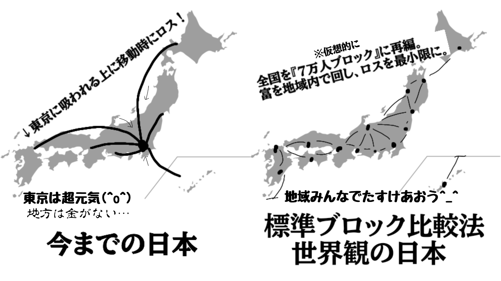
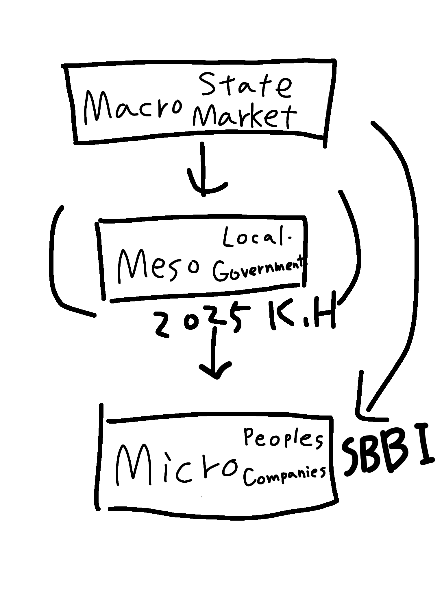

# SBCM Core Theory (v2.0)
**The Axioms of Governance Engineering.** (統治工学の公理体系)

[](https://doi.org/10.5281/zenodo.17762960)
[](https://doi.org/10.5281/zenodo.17766604)
[](https://doi.org/10.5281/zenodo.17777745)
[](https://doi.org/10.5281/zenodo.17890326)
[](https://creativecommons.org/licenses/by/4.0/)

---

> **"Code is Law, but Physics is the Judge."**
> (コードは法なり。されど、物理こそが審判なり。)

---

## 🌌 Overview (概要)

このリポジトリは、**SBCM Alliance** が提唱する「統治工学（Governance Engineering）」の基礎理論を格納するアーカイブです。

v1.0では「メソ経済学」として行政の歪みを指摘しましたが、v2.0ではこれを物理学（流体力学・熱力学）へと拡張しました。ここにあるのは、G-CartやYorbeeといったアプリケーションが従うべき**「社会の物理法則（The Laws of Physics for Society）」**です。

私たちは、政治的な「言葉（Rhetoric）」が支配していた統治の世界を、普遍的な「数理（Math）」によって再構築します。

## 📜 The Scriptures (理論体系)

### 1. The Methodology (静的理論)
**[Proposal for the Standard Block Comparison Method](https://github.com/SBCM-Alliance/core-theory/blob/main/papers/Proposal%20for%20the%20Standard%20Block%20Comparison%20Method%20(SBCM)%20in%20the%20Quantitative%20Evaluation%20of%20Administrative%20Measures_v2.1_.pdf)**
*   日本の統治機構を「標準ブロック ($B_{std}$ = 72,176人)」単位で正規化し、行政事業の歪みを定量評価するフレームワーク。
*   **Key Concepts:** $B_{std}$, $D_{index}$ (Distortion)

### 2. The Field Theory (場の方程式・行政水理学)
**[SBCM Field Theory: Equations of Regional Flux](https://github.com/SBCM-Alliance/core-theory/blob/main/papers/SBCM%20Field%20Theory_%20The%20General%20Equations%20of%20Regional%20Flux%20and%20the%20Control%20of%20Divergence.pdf)**
*   地域経済を離散的なブロックから、連続的な「流体場」へと拡張。富の流出（ストロー効果）をベクトル場の「正の発散 ($\nabla \cdot \mathbf{J} > 0$)」として定義する。
*   **Key Concepts:** Continuity Equation (連続の式), $\nabla \cdot \mathbf{J}$ (Divergence)

### 3. The Thermodynamics (熱力学・限界論)
**[Note #6: The Thermodynamic Limit of Growth](https://github.com/SBCM-Alliance/core-theory/blob/main/notes/SBCM%20Note%20%236_%20The%20Thermodynamic%20Limit%20of%20AI-Driven%20Growth%20(v2.0)%20.pdf)**
*   システムの複雑性が増大すると維持コスト（エントロピー）が非線形に増大し、無限成長（シンギュラリティ）を阻害することを証明する。
*   **Key Concepts:** Heat Death (熱的死), Complexity Penalty ($\gamma$)

### 4. The Elasticity (弾性理論)
**[Note #7: The Theory of Entropic Elasticity](https://github.com/SBCM-Alliance/core-theory/blob/main/notes/SBCM%20Note%20%237_%20The%20Theory%20of%20Entropic%20Elasticity%20(v2.1).pdf)**
*   地域経済を「無限の容器」ではなく「弾性体」と定義する。容量 ($C_{pot}$) を超える予算注入は、物理的な反発力（漏出）を生む。
*   **Key Concepts:** $C_{pot}$ (Potential Capacity), Elastic Rebound (弾性反発)

---

## 📐 The Governing Axioms (統治の公理)

v2.0において、我々の理論は以下の物理法則に集約されます。（詳細は [MATH.md](./MATH.md) を参照）

#### I. The Law of Scale Neutrality (規模中立の法則)
> 「行政の質は、絶対量ではなく、標準ブロックあたりの密度 ($B_{std}$) で評価されなければならない」

#### II. The Law of Flux Continuity (流束連続の法則)
> 「富は保存される。局所的な富の減少（ $\frac{\partial \rho}{\partial t} < 0$ ）は、必ずどこかへの流出（ $\nabla \cdot \mathbf{J} > 0$ ）またはエントロピー増大による散逸として記述される」

#### III. The Law of Entropic Elasticity (エントロピー弾性の法則)
> 「地域の受容容量 ($C_{pot}$) を超過する急激な予算注入 ($S_{in}$) は、すべて『弾性反発』として外部へ漏出し、内部には何も残らない」

#### IV. The Law of Distance Security (距離の法則)
> 「セキュリティは暗号のみにあらず。物理的距離の二乗 ($Distance^2$) をコスト障壁とすることで、遠隔地からの略奪的資本移動を熱力学的に阻止する」

---

## 🛠 Applications (実装)

本理論は以下のシステムに実装されています。

*   **[G-Cart (Governance Cart)](https://github.com/SBCM-Alliance/g-cart):**
    *   インピーダンス・マッチング（ $I(t) \le dC_{pot}/dt$ ）により、予算執行を「点滴化」し、地域内循環を強制する調達プロトコル。
*   **Sona / Yorbee:**
    *   標準ブロック単位でのエネルギーと労働の地産地消を最適化するプラットフォーム。

---

## 📚 Citation (引用)

本理論を学術論文、技術記事、または政策提言で引用する場合は、以下のBibTeXを使用してください。

```bibtex
@article{koyama2026sbcm_v2,
  title={General Theory of Administrative Hydraulics and Entropic Elasticity (SBCM v2.0)},
  author={Koyama, Hokuto and SBCM Alliance},
  journal={Zenodo},
  year={2026},
  url={https://github.com/SBCM-Alliance/core-theory}
}
```

## 📝 Illustrated notes (メモ)


